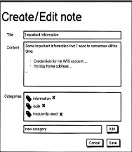
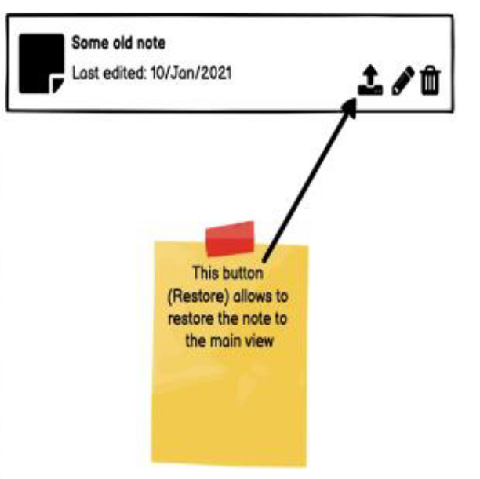
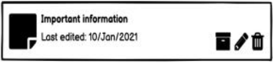
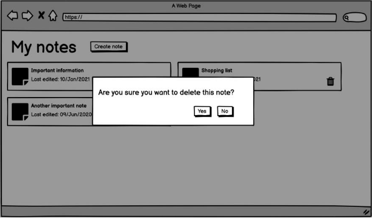

# Frontend challenge React Jr
Link: [Link to this doc](#)

Autor(s): Brian Palomar

Status: [**Draft**, Ready for review, In Review, Reviewed]

Last Updated: 2022/10/19

## Contents
- Goal
- Non-Goals
- Background
- Overview
- Detailed Desing
    - Solution 1
        - Frontend
        - Backend
    - Solution 2
        - Frontend
        - Backend
- Considerations
- Metrics

## Links
- [Vitejs](https://vitejs.dev/)
- [React Boostrap](https://react-bootstrap.github.io/getting-started/introduction/)
- [propTypes and defaultProps](https://frontarm.com/courses/react-fundamentals/odds-and-ends/proptypes-and-defaultprops/)
- [useState lazy initialization](https://kentcdodds.com/blog/use-state-lazy-initialization-and-function-updates)

## Objective

_What and why are we doing this?_

- We are doing this challenge to practice our react skill level.
- Improve our problem resolution skill.
- Get even more comfortable with react

## Goals

- Goals

- Implement a User Interface for a simple web application that allows you to take notes, 
tag and filter them.
- Structure the app as a Single Page web Application, which is the classical way of 
implementing User Interface when using vanilla React 
- The usage of a component library like React Bootstrap or Material UI is extremely 
encouraged 
- A set of services, functions/scripts or a state-management library like Redux need to be 
implemented for storing app state - since there will be no backend [Extra]

## Non Goals

- Non-Goals

- Since there will be no backend, content can be persisted in localStorage or in memory

## Background

N / A

## Overview

We need to create differente react component to complete the defined goals.

These are the component overview

**Create and edit note modal**

**Notes component**

**Notes component archived**

**Modal confirmation - Delete dialog**

_This sections should be understandable by new employees on your team that is not related to the project._

_Put details in the next section._

## Detailed Desing

_Use diagrams where necessary._

_Tools like [Excalidraw](https://excalidraw.com)_

_Cover major changes:_

_- What are the new functions that you will wirte?_

_- Why do you need new components?_

_- Is there any code that can be reusable?_

_Don't elaborate deeply on the implementation details._

## Solution 1

### Frontend

_Frontend_

### Backend

_Backend_

## Solution 2

### Frontend

_Frontend_

### Backend

_Backend_

## Considerations

_Concerns / trade-offs / tech debt_

## Metrics

_What data do you need to validate before launching this feature?_